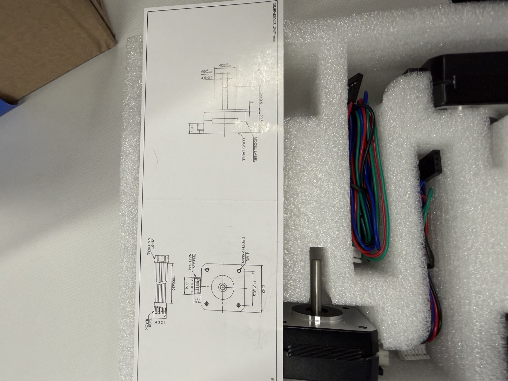
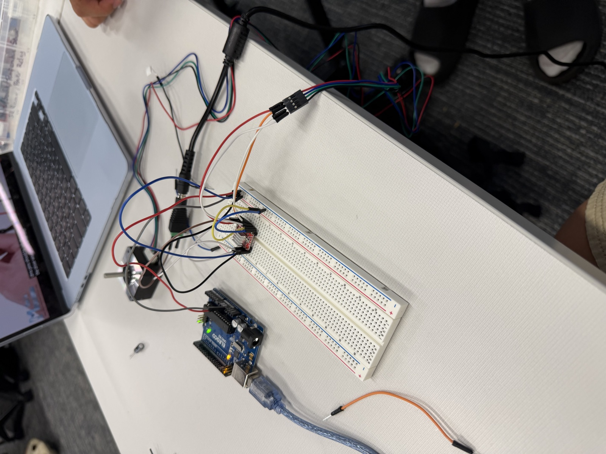
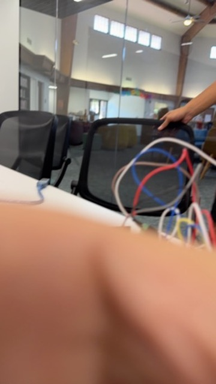
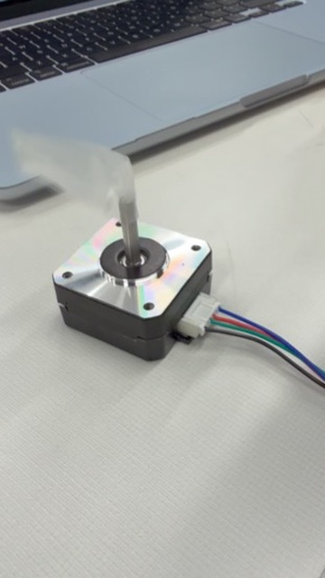

# 10-2-26 · 3D Scanner, Round Two: From Servos to Steppers

## Overview

Last year my partner and I got a 3D scanner to the point where it could move a few degrees, take a reading, and report back distances ([last year's journal](3d%20Scanner.html)). This year we're picking it back up in Tech and Innovation Seminar II, but with a different sensor and a plan to build it back up piece by piece instead of jumping straight to the finished scanner.

## Motivating questions

Can an ultrasonic sensor give us readings that are consistent enough to turn into coordinate points?

Once we have points, what does it take to make the movement precise enough to actually build a scan out of them?

Why are stepper motors worth the extra trouble over servos?

## Materials

Arduino

Ultrasonic distance sensor

Servo motor (first phase)

Stepper motor + driver (current phase)

Breadboard, jumper wires, USB cable to the laptop

## Phase 1: Servo + ultrasonic sensor

We started with a servo because it's the easiest motor to get moving: give it an angle and it goes there. We mounted the ultrasonic sensor on the servo, swept it across, and had the Arduino take a distance reading at each angle. This part worked. Seeing real numbers come back while the sensor turned was a good sign that the setup made sense.

## Phase 2: Coordinate points

A distance by itself doesn't mean much for a scan, so the next step was turning each reading into a point. Since we know the angle the servo is at and the distance the sensor measured, we can convert that into an (x, y) coordinate. We got coordinate point readings coming out of the Arduino, which is the first real building block of an actual scan.

## Phase 3: Moving to stepper motors

Servos got us started, but they have limited range and aren't very precise at small steps. A stepper motor moves in exact, repeatable steps and can keep rotating, which is what a scanner needs if we want the points to line up into a real shape. It's also what we ended up using last year, so we know it's the right direction.

### The breadboard problem

Our first attempt at getting the stepper connected stalled because of our breadboard connection. The stepper and its driver run through the breadboard to get to the Arduino, and somewhere along that path the connection isn't holding, so the signal never makes it from the Arduino to the motor. Before we can even test the stepper code, we need that wiring to be solid.

Things we planned to check:

- That each jumper wire is fully seated in the breadboard and in the right row
- That the driver is actually bridging the right rows, not shorted across the center gap
- That the power rails are connected all the way across (some breadboards split them in the middle)
- That the Arduino and the stepper's power supply share a common ground

### Getting it moving

Once we sorted out the breadboard connection, the signal finally made it from the Arduino through the driver to the motor, and the stepper started turning. We put a small piece of tape on the shaft as a flag so we could actually see it rotate and tell how far each step moved it.

## Personal Journey

### How did I feel?
Getting the servo and the coordinate points working felt good, especially since it went faster than last year. We weren't starting from zero this time.

### How feelings changed
Hitting the connection problem was frustrating because it wasn't even the stepper that was broken, it was the wiring in between. But last year taught me that a lot of this project is being patient and ruling things out one at a time until it works, and that's exactly what happened. Seeing the shaft finally spin made all of it worth it.

### What's next
Now that the stepper moves, the next step is to mount the ultrasonic sensor on it in place of the servo and start collecting coordinate points with real precision.
